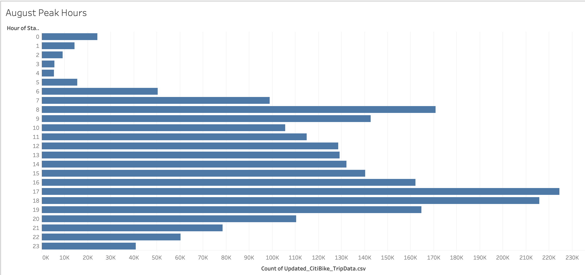

# Bikesharing
## Overview
Analyzed the NYC Citibike data to show potential Des-Moines bikesharing investors how popular the bike-sharing program is. Using Tableau, we visualized several aspects of the data as shown below.

[Tableau Dashboard](https://public.tableau.com/views/NYCCitiBikeAnalysis_16607816316370/CitiBikeDataStory?:language=en-US&publish=yes&:display_count=n&:origin=viz_share_link)

## Results

Checkout Time Per User

Checkout Timer Per User By Gender

Trips By Weekday For Each Hour

Trips By Gender (By Weekday For Each Hour)

User Trips By Gender By Weekday

Total Number of Rides

August Peak Hours

## Summary
